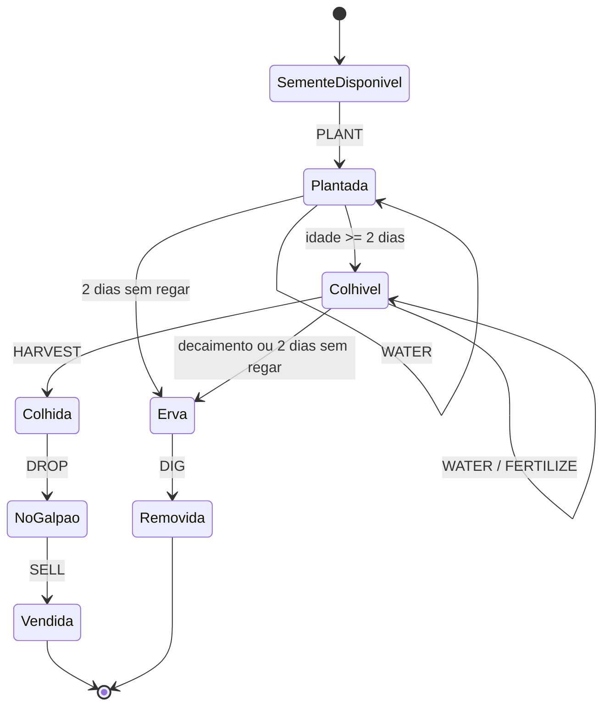
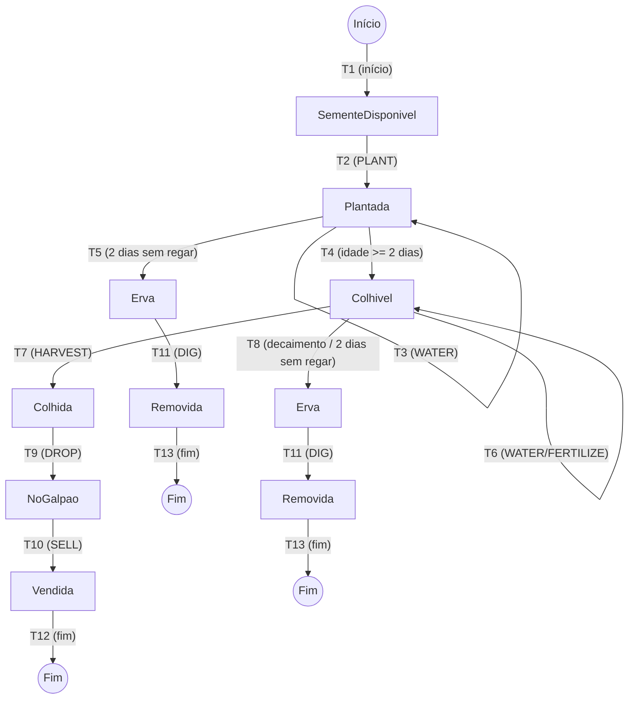

# Modelagem e Testes - Kaggriculture (Carrot)

Esse documento centraliza a modelagem e a elaboração dos casos de teste referentes ao objeto **Cenoura** no sistema Kaggriculture.

---

## 1. Máquina de Estados (Modelo)

Modelagem do comportamento da Cenoura, mapeando estados, transições e os respectivos eventos/condições associados.

### Diagrama em Mermaid.js

### Diagrama em PlantUML

---

## 2. Tabelas de Estados

Estados do modelo: SementeDisponivel, Plantada, Colhivel, Colhida,
NoGalpao, Vendida, Erva, Removida.

## Casos de teste

### CT-E1 - Ciclo de venda bem-sucedido
Sequência de eventos: PLANT → WATER → (idade >= 2 dias) → HARVEST → DROP → SELL

Estados visitados:
SementeDisponivel → Plantada → Colhivel → Colhida → NoGalpao → Vendida

### CT-E2 - Perda da planta por falta de rega
Sequência de eventos: PLANT → (2 dias sem regar) → DIG

Estados visitados:
SementeDisponivel → Plantada → Erva → Removida

## Verificação da cobertura

| Estado            | Coberto por |
|-------------------|-------------|
| SementeDisponivel | CT-E1, CT-E2 |
| Plantada          | CT-E1, CT-E2 |
| Colhivel          | CT-E1       |
| Colhida           | CT-E1       |
| NoGalpao          | CT-E1       |
| Vendida           | CT-E1       |
| Erva              | CT-E2       |
| Removida          | CT-E2       |

Os dois casos de teste juntos visitam todos os 8 estados -> cobertura de
estados completa.

---

## 3. Tabelas de Transições

| ID  | Origem            | Destino           | Evento / Condição              |
|-----|-------------------|-------------------|--------------------------------|
| T1  | [*]               | SementeDisponivel | (início)                       |
| T2  | SementeDisponivel | Plantada          | PLANT                          |
| T3  | Plantada          | Plantada          | WATER                          |
| T4  | Plantada          | Colhivel          | idade >= 2 dias                |
| T5  | Plantada          | Erva              | 2 dias sem regar               |
| T6  | Colhivel          | Colhivel          | WATER / FERTILIZE              |
| T7  | Colhivel          | Colhida           | HARVEST                        |
| T8  | Colhivel          | Erva              | decaimento ou 2 dias sem regar |
| T9  | Colhida           | NoGalpao          | DROP                           |
| T10 | NoGalpao          | Vendida           | SELL                           |
| T11 | Erva              | Removida          | DIG                            |
| T12 | Vendida           | [*]               | (fim)                          |
| T13 | Removida          | [*]               | (fim)                          |

## Casos de teste

### CT-T1 - Ciclo de venda completo-
Eventos: PLANT → WATER → (idade >= 2) → FERTILIZE/WATER → HARVEST → DROP → SELL
Transições exercitadas: T1, T2, T3, T4, T6, T7, T9, T10, T12

### CT-T2 - Perda na fase Plantada
Eventos: PLANT → (2 dias sem regar) → DIG
Transições exercitadas: T2, T5, T11, T13

### CT-T3 - Perda na fase Colhivel
Eventos: PLANT → WATER → (idade >= 2) → (decaimento ou 2 dias sem regar) → DIG
Transições exercitadas: T4, T8, T11

## Verificação da cobertura

| Transição | Coberta por        |
|-----------|--------------------|
| T1        | CT-T1              |
| T2        | CT-T1, CT-T2       |
| T3        | CT-T1              |
| T4        | CT-T1, CT-T3       |
| T5        | CT-T2              |
| T6        | CT-T1              |
| T7        | CT-T1              |
| T8        | CT-T3              |
| T9        | CT-T1              |
| T10       | CT-T1              |
| T11       | CT-T2, CT-T3       |
| T12       | CT-T1              |
| T13       | CT-T2              |

Os três casos de teste juntos exercitam todas as 13 transições ->
cobertura de transições completa.

---

## 4. Árvore de Caminhos

