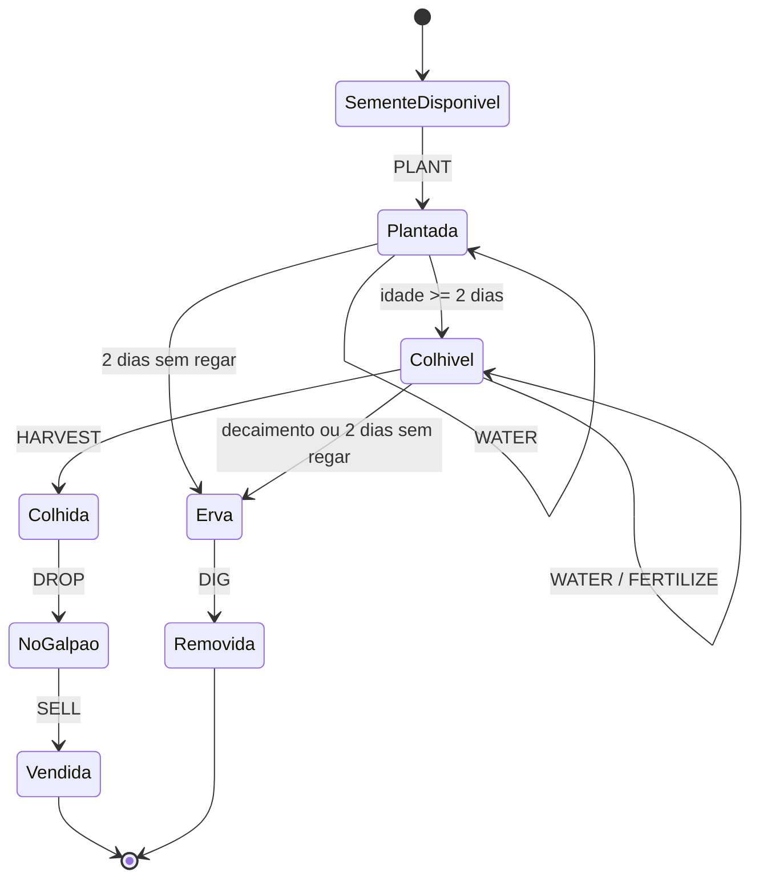

# Máquina de Estados - Cenoura (Mermaid)

```mermaid
stateDiagram-v2
    [*] --> SementeDisponivel

    SementeDisponivel --> Plantada : PLANT
    Plantada --> Plantada : WATER
    Plantada --> Colhivel : idade >= 2 dias
    Plantada --> Erva : 2 dias sem regar
    Colhivel --> Colhivel : WATER / FERTILIZE
    Colhivel --> Colhida : HARVEST
    Colhivel --> Erva : decaimento ou 2 dias sem regar
    Colhida --> NoGalpao : DROP
    NoGalpao --> Vendida : SELL
    Erva --> Removida : DIG
    Vendida --> [*]
    Removida --> [*]
```
