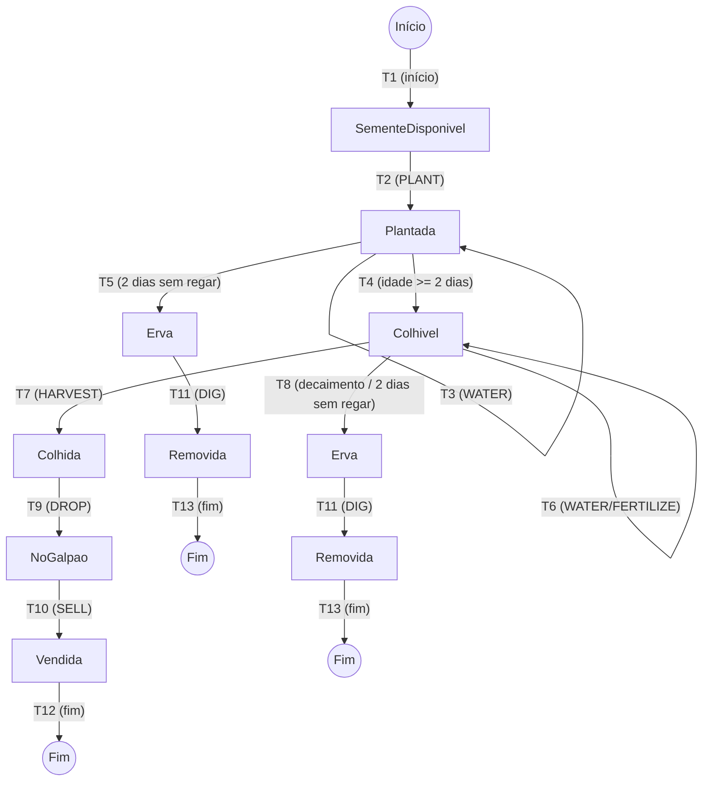

# Árvore de Caminhos - Cenoura

A Árvore em questão foi projetada percorrendo as transições que ocorrem na Máquina de Estados da Cenoura a partir do estado inicial, percorrendo as transições de acordo com as tabelas de Cobertura de Estados e Transições até os estados finais.

